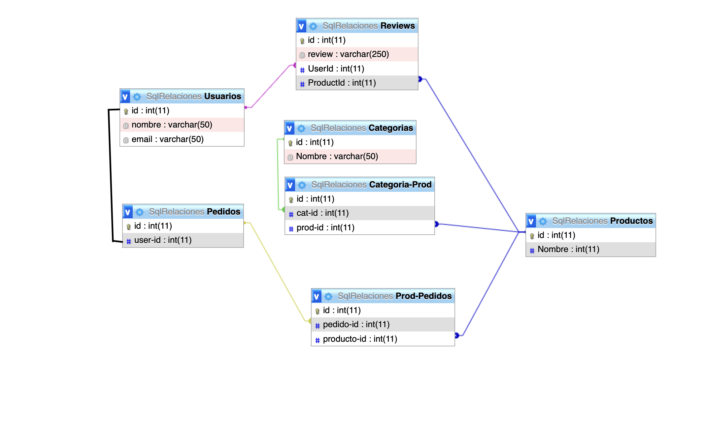

# Happy e-Comerce

## Description

This is a Node Js backend project for handeling a online shop. 

## Table of Contents

- [Installation](#installation)
- [Data Base structure](#data-base-structure)
- [File structure](#file-structure)
- [Usage](#usage)
- [API Routes](#api-routes)
- [Contributing](#contributing)
- [License](#license)
- [Contact](#contact)
## Installation

Download the repository, install the dependencies with npm.

1. Clone the repository:

    git clone https://github.com/BrunoMalfi/backend-project-1 

2. Navigate to the project directory

    cd projectname
3. Install dependencies:

    npm install
    
4. Set up environment variables in config.example.json

5. start server with npm start or npm run dev to run it with nodemon

## Api documentation
[End point documentation ](https://documenter.getpostman.com/view/34760486/2sA3JJ9hxn#5eb4683a-7ec0-41f2-8e8a-2cae8583e285)
    
## Data Base structure

##

## File structure
### Models

- **Review:** Defines the schema for reviews, including the review text, product ID, and user ID.
- **User:** Defines the schema for users, including their name, email, password, and role.
- **Token:** Represents authentication tokens associated with users.
- **Category:** Represents product categories.
- **Product:** Represents products, including their description, price, item number, and image path.
- **CategoryProduct:** Represents the many-to-many relationship between categories and products.

### Seeders

- **20240504133306-demo-product.js:** Seeds the database with some demo product data.

## Controllers

- **UserControllers.js:** Handles user-related operations like user creation, login, getting user orders, and logout.
- **ReviewController.js:** Manages CRUD operations for reviews and fetching reviews by various criteria.
- **CategoryController.js:** Handles category-related operations like category creation, update, deletion, and retrieval.
- **OrderControllers.js:** Manages orders, including creation and retrieval of all orders.
- **ProductController.js:** Handles product-related operations like product creation, update, deletion, and retrieval by various criteria.

### Routes

- **categories.js:** Defines routes related to categories, including creating, updating, deleting, and retrieving categories.
- **orders.js:** Defines routes for creating orders and retrieving all orders.
- **products.js:** Defines routes for managing products, including CRUD operations and various retrieval methods.
- **reviews.js:** Contains routes for managing reviews, including CRUD operations and fetching reviews by different criteria.
- **users.js:** Defines routes related to users, including user creation, login, getting user orders, and logout.

### Middleware

- **authentication.js:** Contains middleware for user authentication and authorization.
- **multer.js:** Middleware for handling file uploads, specifically for product images.

## Usage

Explain how to use your project. Provide examples or screenshots if applicable. You can also include a link to any live demo or documentation.

## API Routes

Briefly describe the available API routes and their functionality. You can also provide examples of requests and responses.

### Users

- `/users/new`: Create a new user.
- `/users/login`: User login.
- `/users/getuserorders/:id`: Get orders associated with a user.
- `/users/logout/:id`: Logout a user.

### Products

- `/products/new`: Create a new product.
- `/products/update/:id`: Update an existing product.
- `/products/delete/:id`: Delete a product.
- `/products/showallitems`: Get all products.
- `/products/getitembyid/:id`: Get a product by ID.
- `/products/getitembydescription/:title`: Get a product by description.
- `/products/getitembyprice/:price`: Get a product by price.
- `/products/getallItemsorderbyprice`: Get all products ordered by price.

### Orders

- `/orders/new`: Create a new order.
- `/orders/showallorders`: Get all orders.

### Categories

- `/categories/new`: Create a new category.
- `/categories/update/:id`: Update an existing category.
- `/categories/delete/:id`: Delete a category.
- `/categories/getcategorybyid/:id`: Get a category by ID.
- `/categories/showallcategories`: Get all categories.
- `/categories/getcategorybyname/:name`: Get a category by name.

### Reviews

- `/reviews/new`: Create a new review.
- `/reviews/update/:id`: Update an existing review.
- `/reviews/delete/:id`: Delete a review.
- `/reviews/showallreviews`: Get all reviews.
- `/reviews/showreviewbyid/:id`: Get a review by ID.
- `/reviews/showreviewsbyitemid/:id`: Get reviews for a specific item.

## Contributing

Explain how others can contribute to your project. Include guidelines for submitting bug reports, feature requests, or pull requests.

## License

This project is licensed under the terms of the [MIT License](LICENSE).

## Contact

If you have any questions, suggestions, or feedback, feel free to contact me:

- Email: [your-email@example.com](mailto:your-email@example.com)
- GitHub: [YourGitHubUsername](https://github.com/YourGitHubUsername)